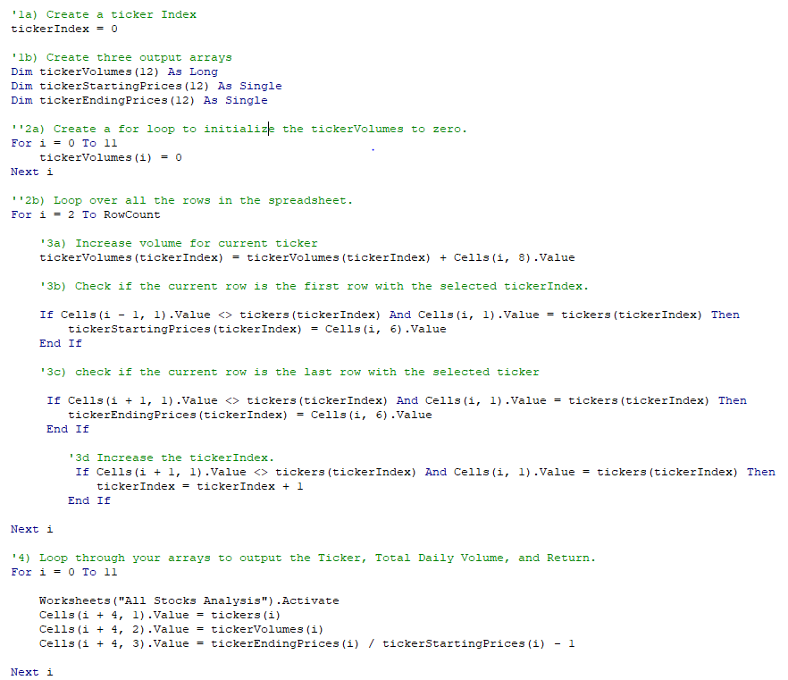

# Stock Analysis

## I. Overview of Project

### Background
Steve has been researching about green stocks to help his parents in their investment decisions and the workbook we prepared for him proved very useful. But for his next step, he then wants to analyze the entire stock market over the last few years.  

### Objective
Since the workbook we provided for him was set-up to analyze just 12 stocks, we need to refactor the code in order to collect the same information much faster, so that it can be applicable for analyzing thousands of stocks. 

## II. [Analysis and Results](VBA_Challenge.xlsm)

### A. Refactoring
The 4 major steps taken in refactoring the code are shown below:

AA

### B. AA

AA

## III. Summary
- 
- 
