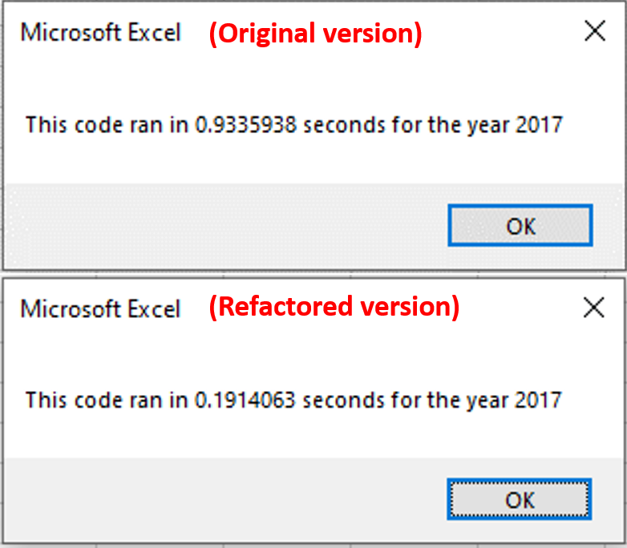

# Stock Analysis

## I. Overview of Project

### Background
Steve has been researching about green stocks to help his parents in their investment decisions and the workbook we prepared for him proved very useful. But for his next step, he then wants to analyze the entire stock market over the last few years.  

### Objective
Since the workbook we provided for him was set-up to analyze just 12 stocks, we need to refactor the code in order to collect the same information much faster, so that it can be applicable for analyzing thousands of stocks. 

## II. [Analysis and Results](VBA_Challenge.xlsm)

### A. Results

Most of the green stocks had a positive return in 2017 except for TERP.

But in 2018, only 2 stocks (ENPH and RUN) had a positive return. Looking for investments in other sectors is highly recommended

### B. Refactored Code
The 4 major steps taken in refactoring the code are shown below:

The most significant changes in the code is that:
- We declared the Starting Price and Ending Price variables as Single which is more applicable since the values only have 2 decimals. This can 
- Instead of searching for one ticker data 12 times, we searched the 12 tickers' data in one pass.

### C. Execution Time

## III. Summary
- 
- 
